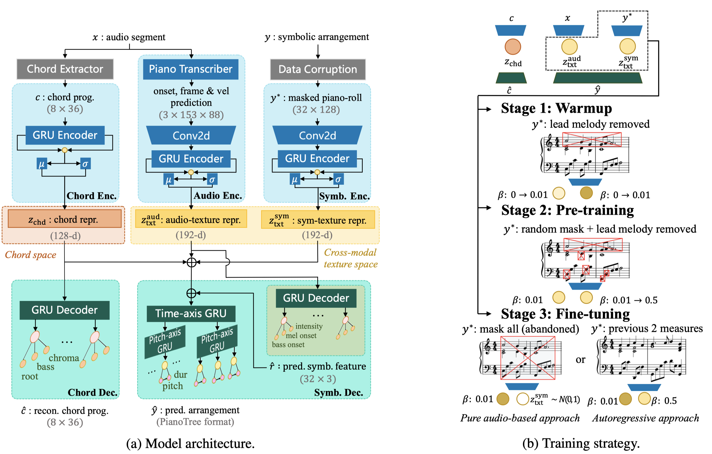
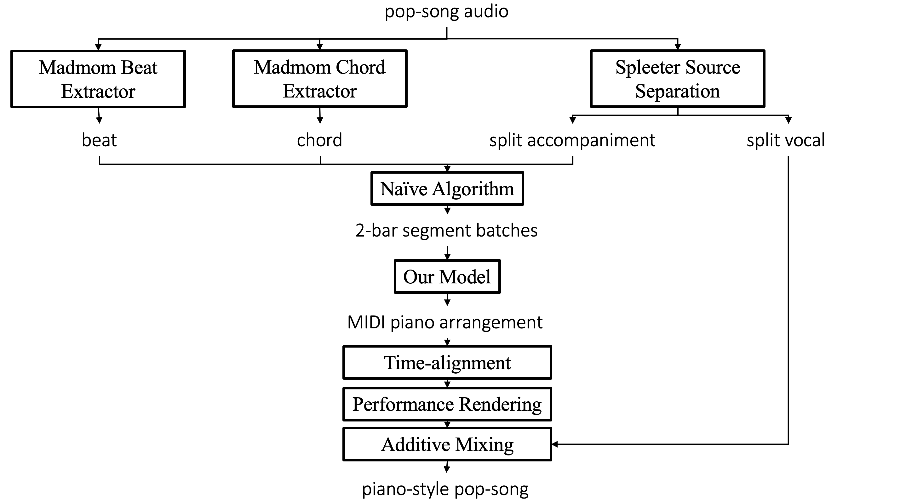

# Automatic Audio-to-symbolic Arrangement

This is the repository of the project
> Ziyu Wang, Dejing Xu, Gus Xia and Ying Shan, "Audio-to-symbolic Arrangement via Cross-modal Music Representation Learning," in ICASSP, 2022 (**[arXiv:2112.15110](https://arxiv.org/abs/2112.15110)**).

## Model Overview

We propose an audio-to-symbolic generative model to transfer an input audio to its piano arrangement (in MIDI format). The task is similar to piano cover song production based on the original pop songs, or piano score reduction based on a classical symphony.  

The input audio is a pop-song audio under arbitrary instrumentation. The output is a MIDI piano arrangement of the original audio which keeps most musical information (incdluding chord, groove and lead melody). The model is built upon the previous projects including [EC2-VAE](https://arxiv.org/abs/1906.03626), [PianoTree VAE](https://arxiv.org/abs/2008.07118), and [Poly-Dis](https://arxiv.org/abs/2008.07122). The novelty of this study is the cross-modal representation disentanglement design and the 3-step training strategy shown below.



## Application

This audio-to-symbolic conversion and arrangement module can lead to many applications (e.g., music score generation, automatic acccompaniment etc.) In this project, we demonstrate a specific application: **audio-level pop style transfer**, in which we transfer a pop song "vocal + (full band) accompaniment" to "vocal + piano accompaniment".  The automation is an integration of spleeter source separation, audio-to-symbolic conversion, performance rendering, and synthesis (as shown in the diagram below).




## Quick Start

In `demo/audio2midi_out` we presents generated results in separated song folders. In each song folder, there is a MIDI file and an audio file. 

* The MIDI file is the generated piano arrangement by our model (with rule-based performance rendering).
* The audio file is a combination of the generated piano arragement and the original vocal (separated by Spleeter) using GarageBand. 

In this section, we demonstrate how to use our model to reproduce the demo. Later on, you can generate piano arrangement with your own inputs.


**Step One:** Prepare the python environment specified by  `requirements.txt`.

**Step Two**: Download the pre-trained model parameter files and put them under `params`. ([Link](https://drive.google.com/file/d/1PPyw4rfXSLYXr3NgsNgwnIyr-avFMErX/view?usp=sharing))

**Step Three**: Source separation the audio files at `demo/example_audio` using [Spleeter](https://github.com/deezer/spleeter) and output the results at `demo/spleeter_out` (see the original repository for more detail). If you do not want to run Spleeter right now, we have prepare the seprated result for you at `demo/spleeter_out`.

**Step Four**: Run the following command at the project *root* directory:

```
python scripts/inference_pop_style_transfer.py ./demo/spleeter_out/example1/accompaniment.wav ./demo/audio2midi_out/example1
python scripts/inference_pop_style_transfer.py ./demo/spleeter_out/example2/accompaniment.wav ./demo/audio2midi_out/example2
```


Here, the first parameter after `inference_pop_style_transfer.py` is the input audio file path, and the second parameter is the output MIDI folder. The command also allows applying different models, switching autoregressive mode, and many other options. See more details by

```
python scripts/inference_pop_style_transfer.py -h
```

The generated MIDI files can be found at `demo/audio2midi_out`. Then, the MIDI arrangement and vocal audio can be combined and further processed in the DAW. 


## Project Details

Before discussing the audio-to-midi conversion in more detail, we introduce different models and training stages that can be specified in the command.

### Model Types

There are four model types (or `model_id`):

* (**a2s**):  the proposed model (requiring chord extraction because it learns disentangled latent chord representation).
* (**a2s-nochd**): the proposed model without chord latent representation (i.e.,  removing chord encoder or chord decoder).
* (**supervised**): pure supervised training (audio encoder + symbolic decoder (without symbolic feature decoding)). No resampling and KL penalty.
* (**supervised+kl**): model architecture is same as **supervised**. Resampling and KL penalty is applied (to audio-texture representation).

In general, **a2s** and **a2s-nochd** perform the best as they are the proposed models. The rest are baseline models in the paper. (Note: the other baseline model (Chord-based generation) is not implemented because it does not depend on any audio information.)

### Stages (Autoregressive Mode)

As shown in the diagram above, **a2s** and **a2s-nochd** have 3 training stages, where stage 1 and 2 are not ready to be used, and stage 3 has two options (i.e., pure audio-based and autoregression).

*  (**Stage 3a**): pure audio-based. The model input is the audio itself.
* (**Stage 3b**): autoregression. The model input is the audio itself and previous 2-measure output.

During inference, `autoregressive=True` mode means we use a **stage 3b** model auto regressively, and use **stage 3a** model to compute the initial segment. On the other hand, `autoregressive=False` model means we use a **stage 3a** model to arrangement every 2-measure segment independently. In general, `autoregressive=False` gives output of slightly higher quality.


## Audio2midi Command

Run audio2midi in command line using the command:

```
python scripts/inference_pop_style_transfer.py <input_acc_audio_path> <output_midi_folder_path>
```

**Note**: the command should be run at the project *root* directory. For clarity, the user can only specify the output MIDI folder (where possibly multiple versions of MIDI arrangement will be produced in the same folder). To specify output MIDI filename, see the python interfance section below.

The command has the following functions:

1. To specify `model_id` using `-m` or `--model` (default to be **a2s**), e.g.,

   ```
   python scripts/inference_pop_style_transfer.py <input_acc_audio_path> <output_midi_folder_path> --model a2s-nochd
   ```

2. To turn on autoregressive mode using `-a` or `--auto` (detault to be `autoregressive=False`), e.g., 

   ```
   python scripts/inference_pop_style_transfer.py <input_acc_audio_path> <output_midi_folder_path> --auto
   ```

3. By default, the beat and chord analysis (a preprocessing step by `madmom`) will be applied to the separated accompaniment track. The analysis can also be applied to the original audio using `-o` or `--original`, (though there are usually no aparent difference), e.g.,

   ```
   python scripts/inference_pop_style_transfer.py <input_acc_audio_path> <output_midi_folder_path> --original <input_audio_path>
   ```

4. At the early stage of this research, we only have **stage 3a** and **stage 3b** has not been developed yet. We provide the model parameter of the old **stage 3a** model and name it after the *alternative model*. The generation results also sound good in general. The alternative model can be called by `--alt`, e.g.,

   ```
   python scripts/inference_pop_style_transfer.py <input_acc_audio_path> <output_midi_folder_path> --alt
   ```

   Alternative model can be also called in autoregressive mode, where the model for initial computation will be replaced with the alternation.

5. To run through all the model types, autoregressive modes and alternative models, using `--model all`, e.g.,

   ```
   python scripts/inference_pop_style_transfer.py <input_acc_audio_path> <output_midi_folder_path> --model all
   ```

For more detail, check it out using

```
python scripts/inference_pop_style_transfer.py -h
```


## Audio2midi Python Interface

To use the model in a more flexible fashion (e.g., use your own trained model parameter, combine the a2s routine in your project, or run multiple files at a time), we provide the python interface. Specifically, call the functions in the  `pop_style_transfer` package. For example, in a python script outside this project, we can write the following python code:

```python
from audio2midi.pop_style_transfer import acc_audio_to_midi, load_model

model, model0 = load_model(model_id='a2s', 
                           autoregressive=False,
                           alt=False
                          )

acc_audio_to_midi(input_acc_audio_path=...,
                  output_midi_path=...,
                  model=model, 
                  model0=model0,
                  input_audio_path=..., 
                  input_analysis_npy_path=...,
                  save_analysis_npy_path=..., 
                  batch_size=...
                 )
```

**Note**: Unlike in the command line mode where output location can only be a folder directory, we can specify filename in the python interface. Also, chord and beat preprocessing can be loaded or stored, and batch size can be chaged.


## Data

We use the [POP909 dataset](https://github.com/music-x-lab/POP909-Dataset) and its time-aligned audio files. The audio files are colloected from the internet. The data should be processed and put under the `data` folder. Specifically, there are 4 sub-folders:

* `data/audio-midi-combined`: contain 909 folders of 909 songs. In ecah folder, we have 
  *  `audio.mp3` the original audio
  *  `midi` folder containing the MIDI arrangement and annotation files.
  *  `split audio` folder containing the vocal-accompaniment separation result using *spleeter:2stems* model.
* `data/quantized_pop909_4_bin`: containing 909 `npz` files storing pre-processed symbolic data from MIDI and annotation files.
* `data/audio_stretched`: containing 909 pairs of wav and pickle files storing the accompaniment audio time-stretched to 13312 frames per (symbolic) beat under 22050 sample rate (approximately 99.384 bpm).
* `data/train_split`: containing a pickle file for train and valid split ids at song level.

The pre-processed *symbolic-part* of the dataset (i.e., `quantized_pop909_4_bin` and `train_split` can be downloaded at [link](https://drive.google.com/file/d/1dP0FFpiCOMKwcRh0LZhQHCk4SYr_FjnD/view?usp=sharing). 


## Training the model

To train the model, run the scripts in `./scripts/run*.py`, at project *root* directory. The result will be saved in the `result` folder. The model should be trained in a sequential manner. For example, run

```
python ./scripts/run_a2s_stage1.py
```

When the stage `i` model is trained, put the model parameter file path in line 13 of `/scripts/run_a2s_stage{j}.py`, and run

```
python ./scripts/run_a2s_stage{j}.py
```

 Here, `(i, j)` can be `(i=1, j=2), (i=2, j=3), (i=2, j=4)`. (3 for **stage 3a** and 4 for **stage 3b**). The other model types can be run in a similar fashion. The training result can be downloaded at [link](https://drive.google.com/file/d/19dr-SKf7YnY_vPtH-NmPJPk4Q_GibjFs/view?usp=sharing).


## Summary of Materials to Download

* Pre-trained models (put it under `/params`): https://drive.google.com/file/d/1PPyw4rfXSLYXr3NgsNgwnIyr-avFMErX/view?usp=sharing
* Symbolic part of the dataset (put it under `/data`): https://drive.google.com/file/d/1dP0FFpiCOMKwcRh0LZhQHCk4SYr_FjnD/view?usp=sharing
* Training result of all stages (put it under `/result`): https://drive.google.com/file/d/19dr-SKf7YnY_vPtH-NmPJPk4Q_GibjFs/view?usp=sharing


## References

* The example audio files are selected from [RWC databases](https://staff.aist.go.jp/m.goto/RWC-MDB/) (Popular Music Database No. 46 and No. 50).
* Spleeter: https://github.com/deezer/spleeter
* Madmom: https://madmom.readthedocs.io/en/latest/
* POP909 dataset: https://github.com/music-x-lab/POP909-Dataset
* EC2-VAE: https://arxiv.org/abs/1906.03626
* PianoTree VAE: https://arxiv.org/abs/2008.07118
* Poly-Dis: https://arxiv.org/abs/2008.07122
